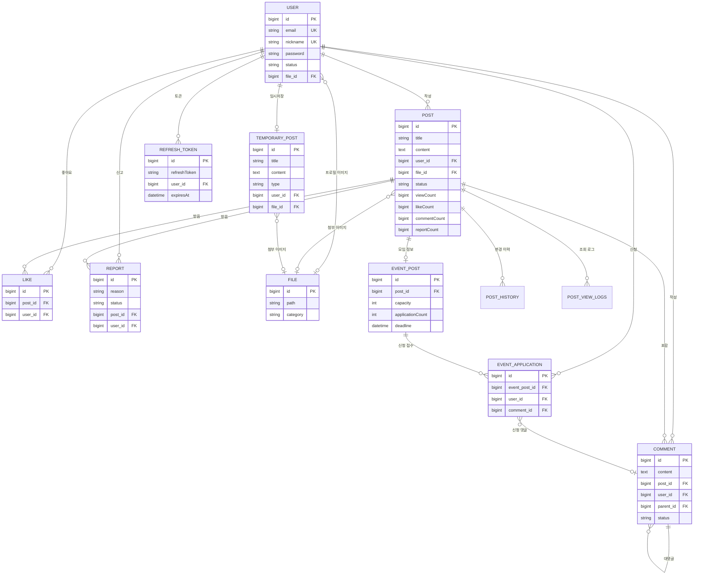

# 🏘️우리동네모임

## Back-end 소개

- 동네 이웃과 소통하고, 관심사 기반 모임을 열고 참여할 수 있는 `커뮤니티 게시판` 프로젝트입니다.
- `Spring Boot`로 서버를 구현하고, `MySQL`로 DB를 사용했습니다.
- 개발은 초기 프로젝트 설정부터 DB 설계, JWT 인증, 파일 업로드, 게시글/댓글, 모임 신청/정원 관리 로직까지 `직접 구현`했습니다.
- Controller-Service-Repository 패턴으로 구현했습니다.

### 개발 인원 및 기간

- 개발기간 : 2026-05-26 ~ 2026-08-09
- 개발 인원 : 백엔드 1명 (본인)

### 사용 기술 및 tools

- Java 26
- Spring Boot 4.0.6
- Spring Web MVC
- Spring Data JPA
- Spring Security
- MySQL 8.4
- JWT
- Docker
- GitHub Actions
- Testcontainers

### Front-end

- <a href="https://github.com/100-hours-a-week/KTB4-Ava-Week10">Front-end Github</a>

### 서비스 시연 영상

- 추후 추가 예정

### 폴더 구조

<details>
  <summary>폴더 구조 보기/숨기기</summary>
  <div markdown="1">

      ├── README.md
      ├── build.gradle
      ├── settings.gradle
      ├── Dockerfile
      ├── docker-compose.yml
      ├── gradlew
      ├── gradlew.bat
      ├── gradle
      │    └── wrapper
      ├── .github
      │    └── workflows
      │         ├── ci.yml
      │         └── cd.yml
      └── src
           ├── main
           │    ├── java/org/ktb/week6
           │    │    ├── config
           │    │    │    ├── FileProperties.java
           │    │    │    ├── SecurityConfig.java
           │    │    │    └── WebConfig.java
           │    │    ├── controller
           │    │    │    ├── AuthController.java
           │    │    │    ├── UserController.java
           │    │    │    ├── PostController.java
           │    │    │    ├── CommentController.java
           │    │    │    └── TemporaryPostController.java
           │    │    ├── service
           │    │    │    ├── AuthService.java
           │    │    │    ├── UserService.java
           │    │    │    ├── PostService.java
           │    │    │    ├── CommentService.java
           │    │    │    ├── TemporaryPostService.java
           │    │    │    ├── EventPostService.java
           │    │    │    └── FileService.java
           │    │    ├── repository
           │    │    ├── entity
           │    │    ├── dto
           │    │    ├── enums
           │    │    ├── exception
           │    │    ├── handler
           │    │    ├── jwt
           │    │    ├── response
           │    │    └── utils
           │    └── resources
           │         ├── application.yaml
           │         ├── application-development.yaml
           │         ├── application-production.yaml
           │         └── spy.properties
           └── test
                └── java/org/ktb/week6

  </div>
</details>

<br/>

## 서버 설계

### 서버 구조

| 도메인 | controller | service | repository |
| :--- | :--- | :--- | :--- |
| 인증 | AuthController | AuthService | RefreshTokenRepository, TokenBlacklistRepository |
| 유저 | UserController | UserService | UserRepository, FileRepository |
| 게시글 | PostController | PostService | PostRepository, LikeRepository, ReportRepository, PostHistoryRepository, PostViewLogsRepository |
| 댓글 | CommentController | CommentService | CommentRepository |
| 임시저장 | TemporaryPostController | TemporaryPostService | TemporaryPostRepository |
| 모임 | - | EventPostService | EventPostRepository, EventApplicationRepository |
| 파일 | - | FileService | FileRepository |

### 구현 기능

#### Auth / Users

```
- 회원 CRUD 기능 구현
- 회원가입, 로그인, 비밀번호 변경 시 BCrypt로 비밀번호 암호화하여 처리
- JWT Access Token / Refresh Token 기반 STATELESS 인증 구현
- Refresh Token은 httpOnly 쿠키로 전달하고, DB에는 해시 값으로 저장
- Access Token은 Authorization 헤더의 Bearer Token으로 인증
- 로그아웃 및 토큰 재발급 시 기존 토큰을 블랙리스트에 등록해 재사용 차단
- 미들웨어 필터를 통해 유효한 JWT를 가진 요청만 인증된 사용자로 처리
- 프로필 이미지는 서버에 저장하고, DB에는 이미지 URL 저장
```

#### Posts

```
- 게시글 CRUD 기능 구현
- 커서 기반 게시글 목록 조회 구현
- 게시글 이미지 업로드 기능 구현
- 좋아요 토글 기능 구현
- 게시글 신고 기능 구현
- 신고가 5회 이상 누적되면 게시글 자동 블라인드 처리
- 동일 사용자의 24시간 내 중복 조회수 증가 방지
- 게시글 수정/삭제 이력을 PostHistory로 관리
- 삭제된 게시글은 조회되지 않도록 처리
```

#### Comments

```
- 댓글 CRUD 기능 구현
- 1단계 대댓글 기능 구현
- 삭제된 댓글은 "삭제된 댓글입니다." 문구로 대체하여 응답
- 탈퇴한 사용자의 댓글은 "탈퇴한 사용자" 문구로 대체하여 응답
- 모임 신청 댓글은 수정/삭제할 수 없도록 처리
```

#### Temporary Posts

```
- 사용자별 임시저장 게시글 생성, 조회, 수정 기능 구현
- 임시저장 글에 제목, 내용, 이미지, 게시글 타입, 모임 정원, 마감일 저장
- 임시저장 글을 정식 게시글로 등록하면 기존 임시저장 이력 삭제
```

#### Meeting Posts

```
- 게시글 타입을 GENERAL / MEETING으로 구분
- MEETING 게시글은 정원(capacity), 마감일(deadline), 신청 인원(applicationCount)을 관리
- MEETING 게시글 작성 시 작성자를 포함해 신청 인원을 1명으로 초기화
- MEETING 게시글 정원은 최소 2명 이상으로 제한
- MEETING 게시글에 댓글을 작성하면 모임 신청으로 처리
- 본인 게시글 신청, 중복 신청, 마감된 모임 신청, 정원 초과 신청 방지
- 비관적 락과 유니크 제약을 사용해 동시 신청 시 정원 초과 및 중복 신청 방지
- 모집 상태를 OPEN / FULL / EXPIRED로 계산해 응답
```

#### File Upload

```
- 프로필 이미지와 게시글 이미지를 서버 로컬 볼륨에 저장
- /public/images/** 경로로 업로드 이미지 정적 리소스 제공
- jpg, jpeg, png, gif, webp 확장자만 허용
- 최대 업로드 크기 3MB 제한
- DB 처리 실패 시 방금 저장한 파일을 정리하는 보상 로직 구현
```

<br/>

## 데이터베이스 설계

### 요구사항 분석

`유저 관리`

- 사용자는 이메일, 비밀번호, 닉네임, 프로필 이미지 정보를 포함하는 유저 관리
- 이메일과 닉네임은 유니크하게 설정하여 중복 방지
- 탈퇴한 사용자는 상태값을 변경해 기존 게시글/댓글과의 관계 유지

`인증 관리`

- 로그인 시 Access Token과 Refresh Token 발급
- Refresh Token은 해시 값으로 저장하여 원본 토큰 노출 방지
- 로그아웃, 탈퇴, 토큰 재발급 시 무효화된 토큰을 블랙리스트로 관리

`게시글 관리`

- 사용자가 제목, 내용, 이미지, 작성일시, 수정일시 등의 정보를 포함하는 게시글 관리
- 게시글은 작성자를 참조하며, 좋아요/신고/조회 로그/변경 이력을 별도 테이블로 관리
- 게시글은 일반 게시글과 모임 게시글로 구분

`댓글 관리`

- 사용자가 내용, 작성자, 작성일시 등의 정보를 포함하는 댓글 관리
- 댓글은 게시글을 참조하며, 자기 자신을 참조해 1단계 대댓글 구조 표현
- 모임 게시글의 댓글은 모임 신청 내역과 연결

`임시저장 관리`

- 사용자는 작성 중인 게시글을 임시저장 가능
- 임시저장 글은 제목, 내용, 이미지, 게시글 타입, 모임 정보를 포함

`모임 관리`

- 모임 게시글은 정원, 마감일, 신청 인원 정보를 포함하며 원본 게시글을 참조
- 모임 게시글 작성자는 신청 인원에 기본 포함되므로 신청 인원은 1명부터 시작
- 모임 정원은 작성자 외 최소 1명이 신청할 수 있도록 2명 이상으로 설정
- 모임 신청 내역은 신청자, 모임 게시글, 신청 댓글을 참조
- 동일 유저의 중복 신청을 막기 위해 유니크 제약 설정

### 모델링

`E-R Diagram`

요구사항을 기반으로 모델링한 E-R Diagram입니다.



<br/>

## 실행 방법

### 환경 변수

| 변수 | 기본값 | 설명 |
| :--- | :--- | :--- |
| JWT_SECRET | 없음 | JWT 서명 키 |
| DB_HOST | localhost | MySQL 호스트 |
| DB_PORT | 3306 | MySQL 포트 |
| DB_NAME | week6 | 데이터베이스 이름 |
| DB_USERNAME | week6 | DB 사용자 |
| DB_PASSWORD | week6 | DB 비밀번호 |
| FILE_UPLOAD_DIR | uploads/images | 이미지 업로드 경로 |

### Local 실행

```bash
docker compose up -d mysql

export JWT_SECRET="local-secret-key-for-jwt-that-is-long-enough-256-bits"
./gradlew bootRun
```

### Test

```bash
./gradlew test
```

### Build

```bash
./gradlew clean bootJar
docker build -t week6-backend .
```

<br/>

## 트러블 슈팅

- 자세한 트러블 슈팅 기록은 <a href="./docs/troubleshooting.md">docs/troubleshooting.md</a>에 정리했습니다.
- 모임 신청 정원 초과 문제, LAZY 연관관계 접근으로 비관적 락이 무력화된 문제, 댓글 수 증가 lost update 문제를 다뤘습니다.
- 각 문제는 문제 상황, 원인, 해결 방법, 검증 과정 순서로 정리했습니다.

<br/>

## 프로젝트 회고

- 전체 회고는 <a href="./docs/retrospective.md">docs/retrospective.md</a>에 정리했습니다.
- 도메인을 `Post`, `EventPost`, `EventApplication`으로 분리하며 책임 기준으로 데이터를 나누는 방법을 고민했습니다.
- 모임 신청 기능을 구현하며 애플리케이션 검증, DB 제약, 비관적 락, 원자적 UPDATE의 역할을 구분했습니다.
- Testcontainers 기반 MySQL 테스트를 통해 실제 DB 락과 트랜잭션 환경에서만 드러나는 문제를 검증했습니다.

<br/>
<br/>
<br/>
